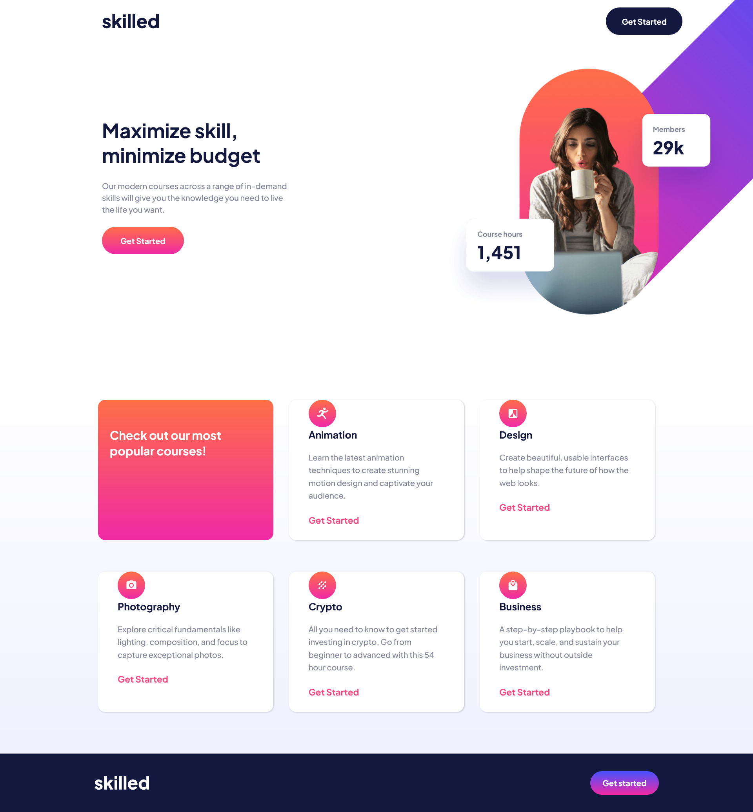
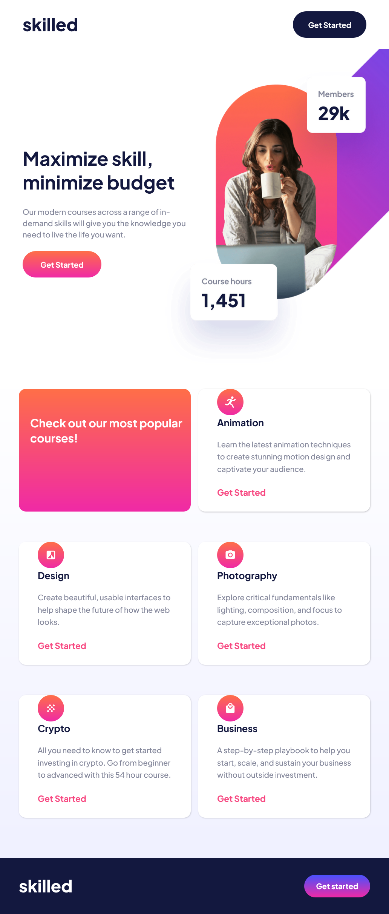
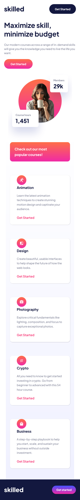

# Frontend Mentor - Skilled e-learning landing page solution

This is a solution to the [Skilled e-learning landing page challenge on Frontend Mentor](https://www.frontendmentor.io/challenges/skilled-elearning-landing-page-S1ObDrZ8q). Frontend Mentor challenges help you improve your coding skills by building realistic projects.

## Table of contents

- [Overview](#overview)
  - [The challenge](#the-challenge)
  - [Screenshot](#screenshot)
  - [Links](#links)
- [My process](#my-process)
  - [Built with](#built-with)
  - [What I learned](#what-i-learned)
  - [Useful resources](#useful-resources)
- [Author](#author)
- [Contributors](#contributors)

## Overview
The challenge was to create a responsive landing page for an e-learning platform.

### The challenge

Users should be able to:

- View the optimal layout depending on their device's screen size
- See hover states for interactive elements

### Screenshot

<div style="display: flex; flex-wrap: wrap; justify-content: space-between;">
  <div style="flex-basis: 30%;">
    
  </div>
  <div style="flex-basis: 30%;">
    
  </div>
  <div style="flex-basis: 30%;">
    
  </div>
</div>

### Links

- Solution URL: (https://www.frontendmentor.io/solutions/responsive-elearning-landing-page-using-css-grid-Ak5xwq6dAx)
- Live Site URL: (https://doileo.github.io/elearning-landing-page/)

## My process
### Introduction
I chose this challenge because I wanted to improve my CSS Grid and Flexbox skills. This was my first time working in a pair with another developer, which taught me the significance of working in a team and sharing different points during the process.

### Built with

- Semantic HTML5 markup
- CSS custom properties
- Flexbox
- CSS Grid
- Mobile-first workflow

### What I learned

Working on this project was a great opportunity to learn and use the transform property for the project's images. The most challenging part was to position the desktop hero image because at the first attempts it was cut off. By using background-position and transform, I was able to position the image correctly.

Here is the CSS code snippet:

```css
.hero-container {
    background: url(../assets/image-hero-desktop@2x.png);
    background-size: 936px;
    background-position: top -8rem right -19rem;
    background-repeat: no-repeat;
    max-width: 144rem;
    padding-bottom: 10rem;
    margin-left: 10rem;
    transform: translateY(-15%);
  }
```

### Useful resources

Here are some resources that I found helpful while working on this project:

- [MDN Web Docs](https://developer.mozilla.org/en-US/) - This is a great reference for HTML, CSS, and JavaScript, and I used it frequently while working on this project.
- [CSS-Tricks](https://css-tricks.com/) - This website has a wealth of information on CSS and front-end development, and I found several helpful articles while working on this project.

## Author

Hi, my name is Doina, and I'm a front-end developer based in Moldova. I have a background in customer service and a passion for creating beautiful and functional websites. When I'm not coding, you can usually find me taking photos of the sky, reading, or listening to some podcasts. Thanks for checking out my project!

- Website - [Doina](https://doileo.github.io/portfolio/)
- Frontend Mentor - [@Doileo](https://www.frontendmentor.io/profile/Doileo)
- LinkedIn - (https://www.linkedin.com/in/doinaleovchindeveloper/)

## Contributors

I had the opportunity to collaborate with Amy Spencer on this project, and it was an amazing experience. We were able to share ideas and solutions, and I learned a lot from her. This was my first time working collaboratively on a coding project, and it taught me the importance of communication and teamwork in web development. Thank you so much, Amy, for the great experience!


